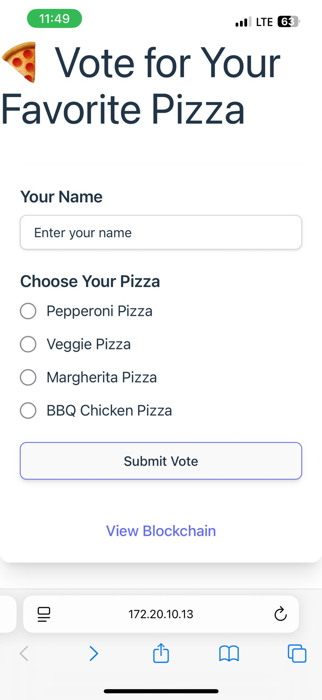
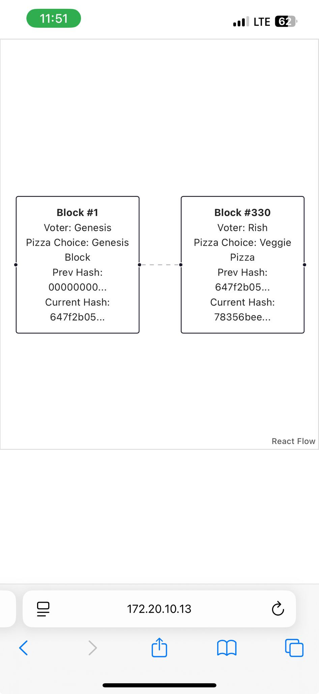
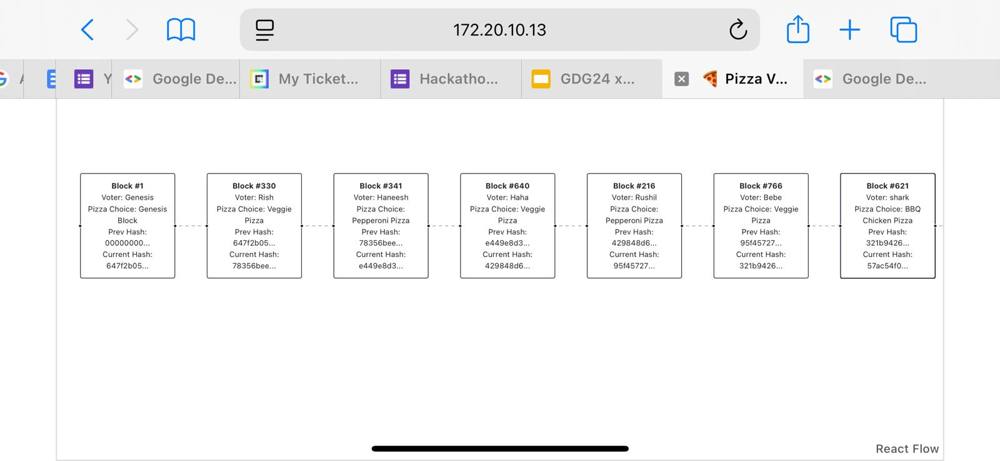

# 🍕 Pizza Voting DApp

This project is a simple decentralized application (DApp) that simulates a blockchain-based voting system for pizza preferences. It was created for the [Blockchain 101: Building The Future With Polkadot](https://gdg.community.dev/events/details/google-gdg-on-campus-northeastern-university-toronto-toronto-canada-presents-blockchain-101-building-the-future-with-polkadot-day-1/) workshop to help people understand how blockchains work by visualizing votes as blocks in a chain.

## Features

- **Vote for your favorite pizza**: Users can submit their name and pizza choice.
- **Blockchain simulation**: Each vote is stored as a block, linked with hashes to the previous block (including a Genesis block).
- **Blockchain visualizer**: See the chain of votes rendered as a graph.
- **Educational**: Designed to demonstrate blockchain concepts like immutability, block hashes, and linking.

## Screenshots:

### Voting Page


### Visualizing the Blockchain
Before opening it up to the audience:


After opening it up to the audience:


## Tech Stack

- **Frontend**: React + TypeScript + Vite
- **Styling**: Tailwind CSS
- **Database**: Supabase (Postgres)
- **Blockchain logic**: Simulated in the frontend/backend, not a real blockchain
- **Visualization**: react-flow-renderer

## Getting Started

### Prerequisites

- [Node.js](https://nodejs.org/) (v18+ recommended)
- [npm](https://www.npmjs.com/) or [yarn](https://yarnpkg.com/)

### Setup

1. **Clone the repository:**
   ```sh
   git clone <your-repo-url>
   cd pizza-voting-app
   ```

2. **Install dependencies:**
   ```sh
   npm install
   # or
   yarn install
   ```

3. **Configure environment variables:**
   - Copy `.env` and set your [Supabase](https://supabase.com/) project URL and anon key:
     ```
     VITE_REACT_SUPABASE_URL=your-supabase-url
     VITE_REACT_SUPABASE_ANON_KEY=your-supabase-anon-key
     ```

4. **Start the development server:**
   ```sh
   npm run dev
   # or
   yarn dev
   ```

5. **Open the app:**
   - Visit [http://localhost:5173](http://localhost:5173) in your browser.

## Usage

- **Vote:** Enter your name and select your favorite pizza, then submit your vote.
- **Visualize:** Click "View Blockchain" to see the chain of votes as blocks, each linked to the previous one.
- **Genesis Block:** The first block is a special "Genesis" block, created automatically if the chain is empty.

## Notes

- Each vote is hashed and linked to the previous vote’s hash, simulating blockchain immutability.
- The visualizer helps users see how blocks are chained together.
- This is not a real blockchain—votes are stored in a database, but the logic mimics blockchain principles.

